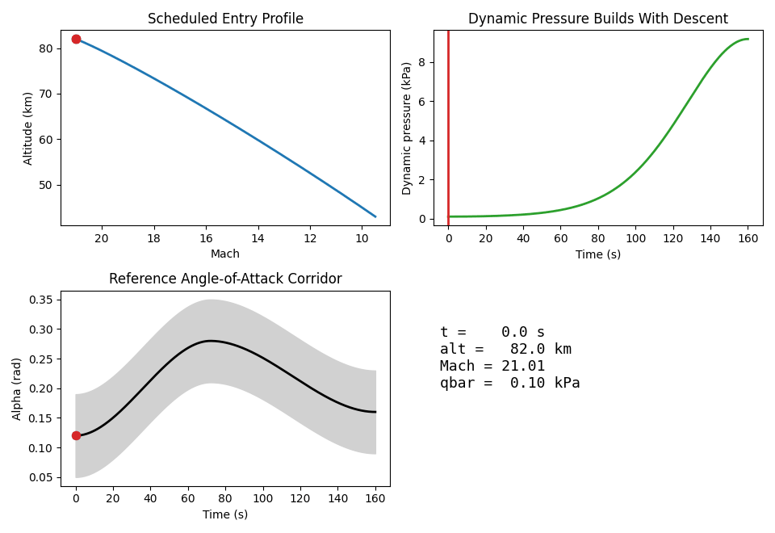
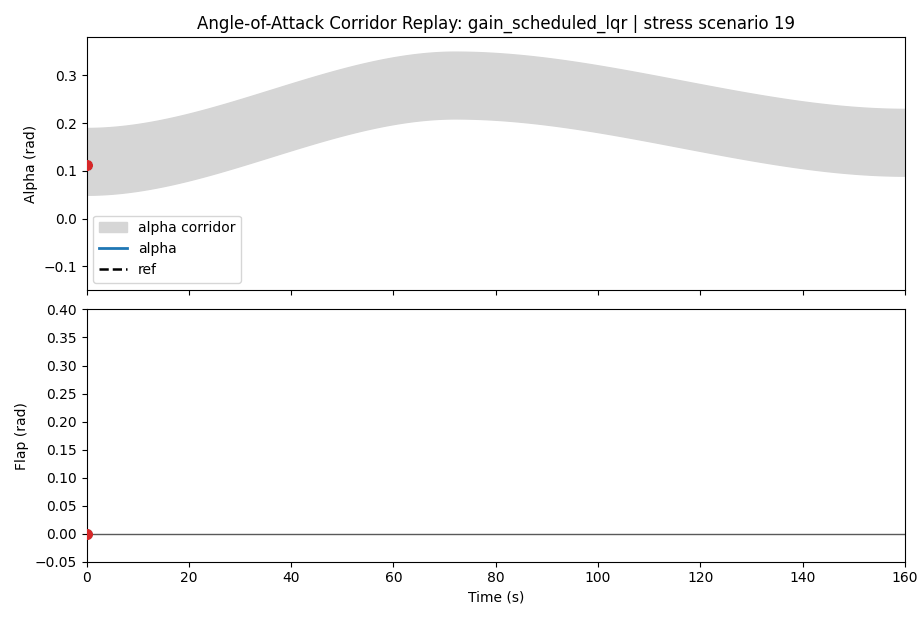
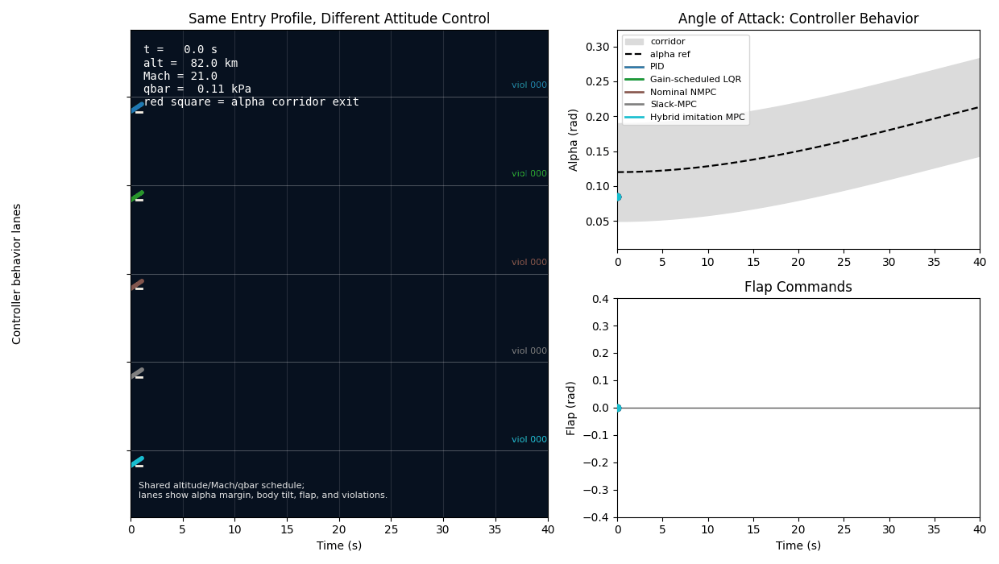

# Hybrid Learning-Augmented MPC for Reentry Attitude Control

This repository is a research-grade benchmark for learning-augmented model
predictive control (MPC) on a reduced-order atmospheric reentry attitude-control
problem. It builds a reproducible longitudinal reentry simulator, reference
profile, attitude corridor, classical baselines, nonlinear MPC controllers,
uncertainty benchmarks, learned residual models, feasibility oracles, and a
hybrid oracle-imitation plus slack-MPC controller.

The project is intentionally a benchmark and technical blog artifact, not an
exact reconstruction of any real reentry vehicle, mission, flight-control stack,
or certified robust-control design. The main technical result is nuanced:
learned residual dynamics alone do not improve strict zero-violation success on
the locked benchmark, but feasibility auditing reveals a higher achievable
ceiling, and the final hybrid imitation + slack-MPC path reaches that audited
ceiling while keeping MPC as the constraint-handling authority.


## Overview

The research asks whether learning can make nonlinear MPC more credible for a
constrained reentry attitude-control task when it is evaluated against fixed
classical baselines, fixed uncertainty scenarios, and fixed corridor-based
success labels.

The answer is deliberately not a victory lap. PID, gain-scheduled LQR, and
nominal NMPC establish the benchmark. Constraint tightening and scenario MPC
probe robust-control ideas. Supervised residual learning predicts a small part
of the model error, but direct residual-corrected NMPC does not improve the
strict success rate. Later phases show why: many failures are feasibility and
actuator-timing problems, not just missing aerodynamic residuals.

The final architecture therefore changes the role of learning. Instead of
letting a learned model directly "fix" MPC, the project uses non-causal slack
oracles to estimate the feasible ceiling, trains online oracle-imitation
policies, and then uses a hybrid controller where learning proposes a useful
prior while slack-MPC decides under actuator and corridor constraints.

All controllers are judged against shared metrics: alpha corridor violations,
pitch-rate corridor violations, flap position/rate limits, solver failures,
unstable-response labels, strict zero-violation success, and, in later phases, a
separate controlled-recovery metric. Failed controllers remain in the project
because they explain the benchmark rather than cluttering it.

### Controller Progression

**Phase 5 nominal benchmark:** PID, gain-scheduled LQR, and nominal NMPC are
evaluated on paired moderate and stress Monte Carlo uncertainty tiers. This
locks the benchmark used by later phases.



**Phase 12 residual-learning MPC:** the PyTorch residual model is integrated
into NMPC variants, but strict success remains unchanged. This is the key
negative learning-augmented result.



**Phases 18-23 feasibility and oracle analysis:** full-horizon slack oracles,
oracle imitation, missed-case autopsies, actuator-aware slack MPC, and audited
feasibility ceilings separate controller failures from benchmark feasibility
limits.

**Phase 24 hybrid imitation + MPC:** a learned oracle-imitation policy proposes
warm-start/prior behavior, while slack-MPC remains the online decision-maker.
This final hybrid controller matches the audited feasibility ceiling on the
fixed benchmark.



## Methodology Summary

The benchmark is organized as 25 additive phases:

- **Phase 1, reduced-order simulator:** longitudinal attitude state
  `[alpha_rad, q_radps, theta_rad]`, flap input, atmosphere utilities, dynamic
  pressure scheduling, aerodynamic pitching moment, RK4 integration, and
  open-loop artifacts.
- **Phase 2, reference and corridor:** configurable altitude, velocity, Mach,
  alpha, theta, and q schedules with alpha/q/flap/flap-rate constraints.
- **Phase 3, classical baselines:** PID and gain-scheduled LQR controllers with
  shared rollout metrics and success/failure labels.
- **Phase 4, nominal NMPC:** CasADi nonlinear MPC with tracking cost, flap
  effort/rate penalties, hard flap bounds, soft alpha/q corridor constraints,
  and solver logs.
- **Phase 5, Monte Carlo benchmark:** paired moderate and stress uncertainty
  scenarios for PID, LQR, and nominal NMPC.
- **Phase 6, tightened NMPC:** robust-control probe that plans inside a smaller
  corridor while evaluating against the original corridor.
- **Phase 7, scenario NMPC:** one shared flap sequence optimized across multiple
  design futures.
- **Phase 8, residual dataset:** supervised truth-minus-nominal residual
  dynamics data.
- **Phase 9, residual model:** PyTorch MLP residual predictor with normalization,
  early stopping, checkpointing, and zero-residual baseline comparison.
- **Phase 10, learned-residual NMPC:** first closed-loop residual correction
  probe using a learned local q-dot correction.
- **Phase 11, horizon-embedded residual MPC:** deterministic residual surrogate
  embedded directly in the CasADi prediction horizon.
- **Phase 12, consolidated learning-augmented benchmark:** nominal,
  residual-corrected, and tightened residual NMPC on the fixed Phase 5
  scenarios.
- **Phase 13, feasibility diagnostics:** when and by how much rollouts leave the
  alpha/q corridor.
- **Phase 14, real-time timing:** PID/LQR/NMPC timing against 10, 20, and 50 Hz
  control-loop budgets.
- **Phase 15, fault injection:** stuck flap, reduced effectiveness, biased
  alpha measurement, actuator delay, density jump, disturbance moment, and
  fallback logging.
- **Phase 16, success-recovery NMPC:** faster-update and corridor-aware NMPC
  variants under unchanged success labels.
- **Phase 17, safety-first control:** actuator-aware safety NMPC and a separate
  controlled-recovery metric.
- **Phase 18, slack oracle:** non-causal full-horizon slack minimization to
  estimate a strict feasibility ceiling.
- **Phase 19, oracle imitation:** online safety policy trained from oracle
  behavior.
- **Phase 20, full oracle-imitation benchmark:** full benchmark comparison
  between online imitation and the oracle ceiling.
- **Phase 21, missed-case autopsy:** replay analysis for oracle-feasible
  scenarios missed by the online policy.
- **Phase 22, actuator-aware slack-MPC:** online slack-first MPC with
  actuator-consistent prediction.
- **Phase 23, feasibility-ceiling audit:** truth-consistent audit of strict and
  near-feasible ceilings.
- **Phase 24, hybrid imitation + MPC:** learning proposes; MPC decides.
- **Phase 25, blog-grade experiment pack:** headline tables, artifact manifest,
  and publication GIFs.

## Key Results

Strict success means the rollout satisfies the original Phase 5-style
zero-violation success label. Controlled recovery is a later secondary metric
for bounded corridor miss without unstable behavior; it is not the same as
strict success.

Headline moderate-tier results:

| Stage | Controller | Strict success | Controlled recovery | Interpretation |
|---|---|---:|---:|---|
| Phase 5 | `pid` | 1/30 | not logged | Original classical baseline. |
| Phase 5 | `gain_scheduled_lqr` | 0/30 | not logged | Original classical baseline. |
| Phase 5 | `nominal_nmpc` | 3/30 | not logged | Best original nominal controller. |
| Phase 12 | `residual_corrected_nmpc` | 3/30 | not logged | Residual learning did not improve strict success. |
| Phase 20 | `ridge_safety` | 15/30 | 24/30 | Oracle imitation scaled to the full benchmark. |
| Phase 22 | `online_slack_mpc_centered` | 15/30 | 24/30 | Slack-first MPC matched the audited ceiling. |
| Phase 23 | `actuator_truth_consistent_oracle` | 15/30 | 24/30 | Non-causal audited ceiling, not an online controller. |
| Phase 24 | `hybrid_blended_slack_mpc` | 15/30 | 24/30 | Final hybrid controller matches the audited ceiling. |

Headline stress-tier results:

| Stage | Controller | Strict success | Controlled recovery | Interpretation |
|---|---|---:|---:|---|
| Phase 5 | `pid` | 2/30 | not logged | Original classical baseline. |
| Phase 5 | `gain_scheduled_lqr` | 0/30 | not logged | Original classical baseline. |
| Phase 5 | `nominal_nmpc` | 3/30 | not logged | Best original nominal controller. |
| Phase 12 | `residual_corrected_nmpc` | 3/30 | not logged | Residual learning did not improve strict success. |
| Phase 20 | `ridge_safety` | 11/30 | 17/30 | Oracle imitation scaled to the full benchmark. |
| Phase 22 | `online_slack_mpc_centered` | 11/30 | 17/30 | Slack-first MPC matched the audited ceiling. |
| Phase 23 | `actuator_truth_consistent_oracle` | 11/30 | 17/30 | Non-causal audited ceiling, not an online controller. |
| Phase 24 | `hybrid_blended_slack_mpc` | 11/30 | 17/30 | Final hybrid controller matches the audited ceiling. |

The headline tables are generated in:

- `outputs/phase25_blog_pack/headline_success_summary.md`
- `outputs/phase25_blog_pack/headline_success_summary.csv`
- `outputs/phase25_blog_pack/blog_pack_summary.md`

## Repository Structure

Important files and directories:

- `README.md` - this overview and reproduction guide.
- `agents.md` - project playbook and operating guide for coding agents.
- `blog/learning-augmented-reentry-mpc.html` - final static blog article.
- `blog/results_tables.md` - table provenance and interpretation notes.
- `blog/figure_captions.md` - figure captions and caveats.
- `plots_manifest.md` - plot and GIF provenance.
- `configs/` - versioned YAML configs for the smoke run and all 25 phases.
- `scripts/` - direct phase runner scripts, `scripts/run_phase*.py`.
- `src/reentry_mpc/` - simulator, controllers, MPC solvers, phase runners, and
  CLI modules.
- `tests/` - phase regression tests.
- `outputs/` - saved trajectories, metrics, solver logs, plots, tables, and
  blog GIFs.
- `01 Textbook/` - long-form technical notes.
- `02 Phase Logs/` - phase-by-phase experiment logs.
- `notes/` - learning notes and checkpoint quizzes.

## Main Entry Points

Install the package in editable mode:

```bash
python -m venv .venv
source .venv/bin/activate
python -m pip install -e ".[dev]"
```

Run the regression and formatting gates:

```bash
pytest
ruff check .
black --check .
```

Run the original smoke scaffold:

```bash
reentry-mpc-smoke --config configs/smoke.yaml --output-dir outputs
```

Run representative phases:

```bash
# Phase 1: simulator artifacts
reentry-mpc-phase1 \
  --config configs/phase1_open_loop.yaml \
  --output-dir outputs/phase1_simulator

# Phase 4: nominal nonlinear MPC
reentry-mpc-phase4 \
  --config configs/phase4_nmpc.yaml \
  --output-dir outputs/phase4_nmpc

# Phase 5: paired Monte Carlo benchmark
reentry-mpc-phase5 \
  --config configs/phase5_monte_carlo.yaml \
  --output-dir outputs/phase5_monte_carlo

# Phase 12: consolidated residual-learning MPC benchmark
reentry-mpc-phase12 \
  --config configs/phase12_learning_augmented_mpc.yaml \
  --output-dir outputs/phase12_learning_augmented_mpc

# Phase 23: audited feasibility ceiling
reentry-mpc-phase23 \
  --config configs/phase23_feasibility_ceiling_audit.yaml \
  --output-dir outputs/phase23_feasibility_ceiling_audit

# Phase 24: hybrid imitation + slack-MPC
reentry-mpc-phase24 \
  --config configs/phase24_hybrid_imitation_mpc.yaml \
  --output-dir outputs/phase24_hybrid_imitation_mpc

# Phase 25: publication tables and GIF manifest
reentry-mpc-phase25 \
  --config configs/phase25_blog_pack.yaml \
  --output-dir outputs/phase25_blog_pack
```

Equivalent script wrappers are available as:

```bash
python scripts/run_phase1_open_loop.py
python scripts/run_phase5_monte_carlo.py
python scripts/run_phase12_learning_augmented_mpc.py
python scripts/run_phase24_hybrid_imitation_mpc.py
python scripts/run_phase25_blog_pack.py
```

Some later phases solve many CasADi nonlinear programs and can take
substantially longer than the early simulator and plotting phases. The checked-in
`outputs/` tree is the reproducibility layer used by the blog.

## Reproducing Results

1. Create the environment and install development dependencies:

```bash
python -m venv .venv
source .venv/bin/activate
python -m pip install -e ".[dev]"
```

2. Run the code-quality gates:

```bash
pytest
ruff check .
black --check .
```

3. Rebuild selected milestone artifacts:

```bash
reentry-mpc-phase1 --config configs/phase1_open_loop.yaml --output-dir outputs/phase1_simulator
reentry-mpc-phase2 --config configs/phase2_reference.yaml --output-dir outputs/phase2_reference
reentry-mpc-phase3 --config configs/phase3_baselines.yaml --output-dir outputs/phase3_baselines
reentry-mpc-phase4 --config configs/phase4_nmpc.yaml --output-dir outputs/phase4_nmpc
reentry-mpc-phase5 --config configs/phase5_monte_carlo.yaml --output-dir outputs/phase5_monte_carlo
```

4. Rebuild the learning-augmented and feasibility milestones:

```bash
reentry-mpc-phase8 --config configs/phase8_residual_dataset.yaml --output-dir outputs/phase8_residual_dataset
reentry-mpc-phase9 --config configs/phase9_residual_model.yaml
reentry-mpc-phase12 --config configs/phase12_learning_augmented_mpc.yaml --output-dir outputs/phase12_learning_augmented_mpc
reentry-mpc-phase20 --config configs/phase20_full_oracle_imitation.yaml --output-dir outputs/phase20_full_oracle_imitation
reentry-mpc-phase23 --config configs/phase23_feasibility_ceiling_audit.yaml --output-dir outputs/phase23_feasibility_ceiling_audit
reentry-mpc-phase24 --config configs/phase24_hybrid_imitation_mpc.yaml --output-dir outputs/phase24_hybrid_imitation_mpc
```

5. Rebuild the blog-grade pack:

```bash
reentry-mpc-phase25 --config configs/phase25_blog_pack.yaml --output-dir outputs/phase25_blog_pack
```

The project playbook records the last audited gate as passing:

- `.venv/bin/pytest`
- `.venv/bin/ruff check .`
- `.venv/bin/black --check .`

## Output Conventions

Major phase runs write structured artifacts under `outputs/<phase_name>/`.
Depending on the phase, these include:

- `trajectory.csv` or combined rollout CSV files for time histories,
- `metrics.json` or summary CSV files for scalar metrics and labels,
- solver logs with status, objective, and solve-time columns,
- generated PNG plots and GIFs,
- Markdown summaries for blog-facing tables,
- JSON manifests for figures, GIFs, and artifact provenance.

The final publication pack lives in `outputs/phase25_blog_pack/`.

## Scope and Limitations

This repository does not claim validated vehicle performance, certified robust
MPC, flight readiness, or general learning-augmented MPC superiority.

The simulator is reduced-order, the uncertainty model is configured for this
study, and the success labels are tied to the fixed benchmark corridors and
tolerances. The main contribution is the reproducible engineering arc: residual
learning alone was not enough, feasibility analysis explained why, and hybrid
imitation + slack-MPC reached the audited benchmark ceiling without removing MPC
from the safety-critical decision loop.
